## Scenario
On your first day of work as an IT engineer, your boss shows you a system that has been compromised. A backup of the system before compromise has been ported to run within a virtual machine. It is your task to find out everything you can about the vm, or you are fired! Submit a short report detailing what you did to the VM, along with what you found. Even if something you do doesn't find anything, still include it in the report! If you get fired, you don't want the next engineer to have to redo your work!

Note: You aren't looking for evidence of compromise! This is a backup of a machine before its compromised, your task is to gather all information you can about it.

## Setup
This is for future reference as well, since I had quite a bit of issues trying to log into the VMs. Eventually, I used the [Linux box](https://nam10.safelinks.protection.outlook.com/?url=https%3A%2F%2Fdellvostroftw.s3.us-east-1.amazonaws.com%2Fccdc.qcow2&data=05%7C02%7Cchtran%40umass.edu%7Cfb87142bfbf544b3f89308dd20a839b6%7C7bd08b0b33954dc194bbd0b2e56a497f%7C0%7C0%7C638702630047922074%7CUnknown%7CTWFpbGZsb3d8eyJFbXB0eU1hcGkiOnRydWUsIlYiOiIwLjAuMDAwMCIsIlAiOiJXaW4zMiIsIkFOIjoiTWFpbCIsIldUIjoyfQ%3D%3D%7C80000%7C%7C%7C&sdata=O6SuAtNg960XAYJZNvM%2FU4sGsO27QppKV0fMmVlvmMM%3D&reserved=0). Since I am using macOS, I used QEMU to create an Ubuntu VM.
```zsh
$ brew install qemu
$ qemu-system-x86_64 -hda ccdc.qcow2 -m 2048 -smp 2 -vga virtio
```
After this challenge though, I will probably practice opening the boxes using Oracle VirtualBox for good practice. For some reason, I face a lot of issues on my machine trying to simulate Windows 11 on VirtualBox (even after installing Windows 11 ISO for ARM-based machines): it was either running into an EFI shell or the VM keeps having to reboot itself. Specifics might be better suited for a separate page, so for now I will just keep the link for instructions [here.](https://kfocus.org/wf/vbox-w11.html#bkm_setup_w11)

## Credentials 
Username: <code>ccdc</code> <br>
Password: <code>ccdc</code>

## What I did
<details>
  <summary>Basic Information (CPU, USB and RAM)</summary>
  
  > Reference: [Red Hat](https://www.redhat.com/en/blog/linux-system-info-commands)
  ### Release Ver.
  This is a Ubuntu 22.04.4 machine.
  
  
  ### Display CPU Information
  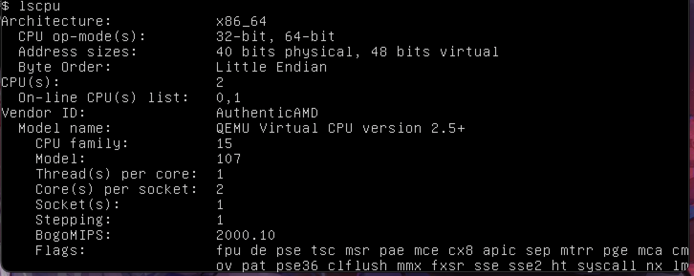

  ### Disk Information
  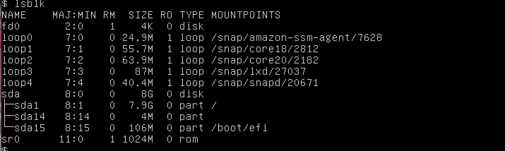

  ### USB
  There is no USB devices on this machine.

  ### PCI
  A summary of all PCI devices
  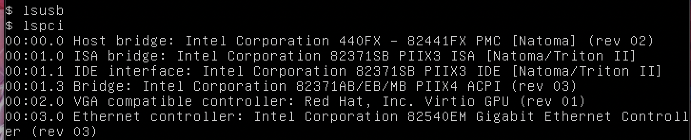

  ### RAM Information
  Basic RAM utilization information
  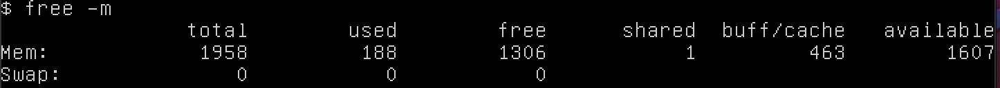

  Use <code>dmidecode</code> for more specific information. <br>
  Memory use:
  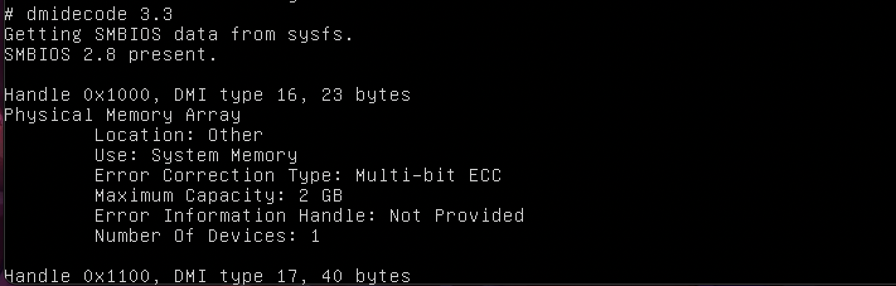
  
  BIOS Info:
  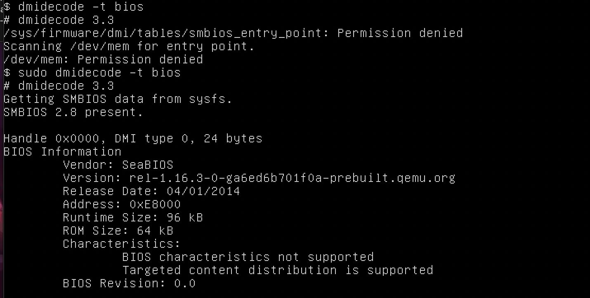
  
  System Info:
  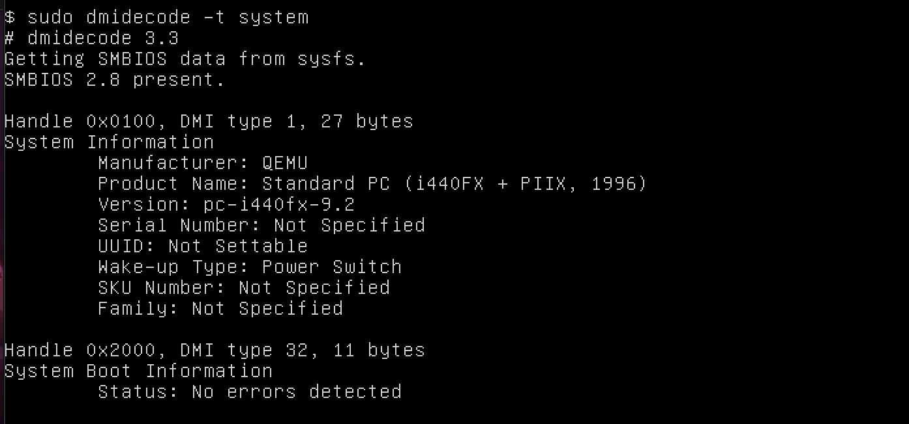
</details>

 ### Upgrade & Update the Kernel
 The first thing to do when investigating any machine is to upgrade the kernel. Yet for some reason I spent a really long time here figuring out why I could not install all the packages (lol).
```shell
$ sudo apt update && sudo apt upgrade 
```
The shell raised some failure to fetch certain packages/files, most namely some ubuntu files and docker updates, even when i opted to run <code>sudo apt-get update</code> or with <code>--fix-missing</code>. It seems the issue lies in the fact that some packages cannot be installed from <code>us-east-1.ec2.archive.ubuntu.com</code>, so it is likely that it is just unavailable storage from AWS EC2 instance. Alternatively, the files <code>/etc/apt/sources.list</code> and <code>/etc/apt/keyrings/docker.gpg</code> might have been corrupted, but after checking with the Ubuntu and Docker documentations I found that they were pretty standard. 

Fun Fact: The terminal got super messed up once I checked the <code>/etc/apt/keyrings/docker.gpg</code>, so I had to reboot the whole thing.
<details>
  <summary>Failure to install all packages</summary>
  
  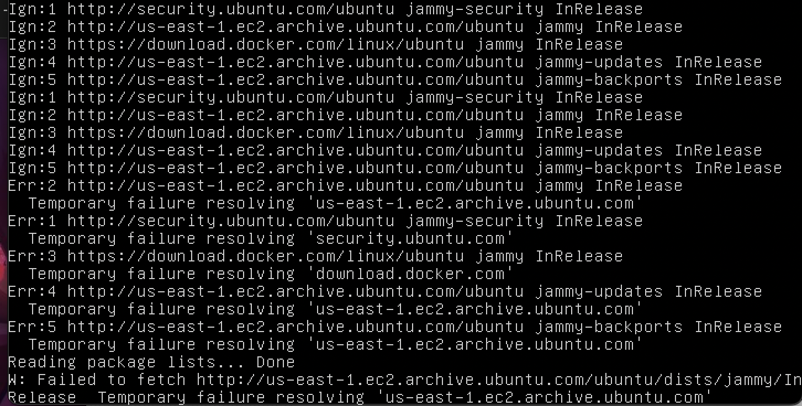
  
</details>

<details>
  <summary>Dependencies look normal</summary>
  
  * Docker
  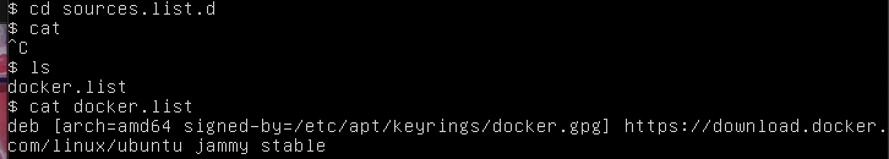

  * Ubuntu
  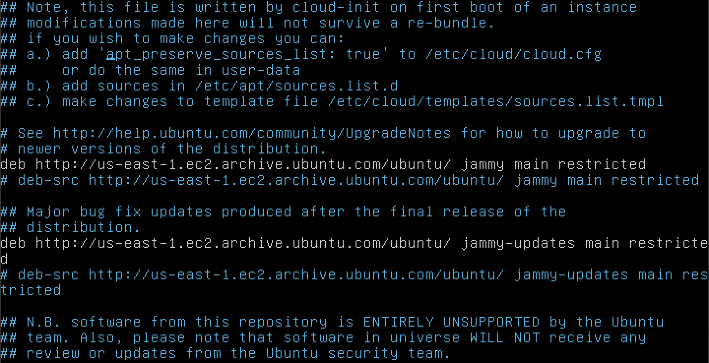

  * Messed up terminal
  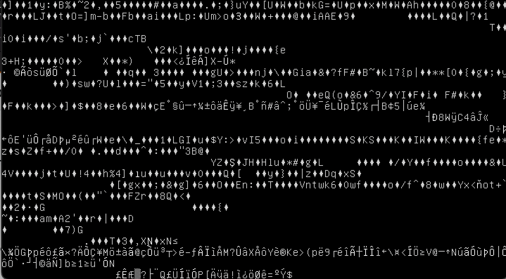
</details>

### Escalating prvilege to Root user
More access (and more privilege) to the machine is always nice (maybe). 
```shell
$ sudo su -
$ sudo -l 
```
<details>
  <summary><code>ls -la</code></summary>

  ```shell
  root@ccdc:~# ls -la /etc/passwd
  -rw-r--r-- 1 root root 1937 Mar 12  2024 /etc/passwd 
  ```
  
  This command allows us to view permission of a file. 
  **Permission Groups are defined as follows:**
  1. Owner
  2. Group
  3. All Users
    
  **Permission Types are defined as follows:**
  1. Read = 4
  2. Write = 2
  3. Execute = 1
  4. – (No permissions set) = 0

  So the <code>/etc/passwd</code> file has the following permission:
  1. File Type
  2. Owner (root) has read and write permissions
  3. Group (root) has read permissions
  4. All Users has read permissions
  5. Number represents hard links to the file
  6. Owner
  7. Group

  Other information:
  1. File Size: 1937
  2. Modification Date: Mar 12 2024

</details>

<details>
  <summary><code>getfacl</code></summary>
  Get file access control list (cannot <code>apt install acl</code>, similar reason to not being able to update the machine).
</details>

<details>
  <summary><code>setfacl</code></summary>
  Set file access control list (cannot <code>apt install acl</code>, similar reason to not being able to update the machine).
</details>

<details>
  <summary><code>chmod</code></summary>
  Change file mode bits
</details>

<details>
  <summary><code>chown</code></summary>
  Change file owner and group
</details>

<details>
  <summary><code>/etc/shadow</code></summary>
  
  * The shadow file is one of the most protected files on a Linux system as it contains the encrypted password used by all known users to log on to the system. It stores the user account information along with details on password settings. If the shadow file can be accessed by an unauthorized user, then attackers can attempt to crack the hash to find the clear text password used. If the password is human-created, this method is often successful for an attacker.
  
  
  * The colon <code>:</code> separated the fields in each <code>passwd</code> file, formatted in this order, from left to right:
  1. Username
  2. Password (typically encrypted in a one-way hash format) such as:
     - $1$ is MD5
     - $2a$ is Blowfish
     - $5$ is SHA-256
     - $6$ is SHA-512
  3. Last password change
  4. Minimum password age
  5. Maximum password age
  6. Warn period
  7. Inactivity period
  8. Expiration date
  9. Unused field

</details>

### Fail2Ban
If you ever connected something to the public internet you might have noticed that within seconds people are knocking on your ports. To avoid people bruteforcing them self into your server you can setup Fail2Ban. Fail2Ban watches logfiles for incorrect logins and automatically bans IP’s. Unfortunately though, once again (just like <code>acl</code>) I could not install the package.
```shell
  root@ccdc:~# apt install fail2ban
  ```

### Logwatch
Similar issue, but the spirit is: Logwatch is a package that parses logs files on your system and sends over a report. This is a useful way to monitor whats going on and ensure you can spot issues more timely and easily.
```shell
  root@ccdc:~# apt install logwatch
  ```

### Setting up firewall (UFW)
UFW stands for uncomplicated firewall. UFW actually is not a firewall itself, instead it is a configuration program for iptables. Installing it can give the machine some extra layer of protection:
 ```shell
  root@ccdc:~# apt install ufw
  ```

```shell
$ sysctl -q net.ipv4.tcp_max_syn_backlog
net.ipv4.tcp_max_syn_backlog
```
